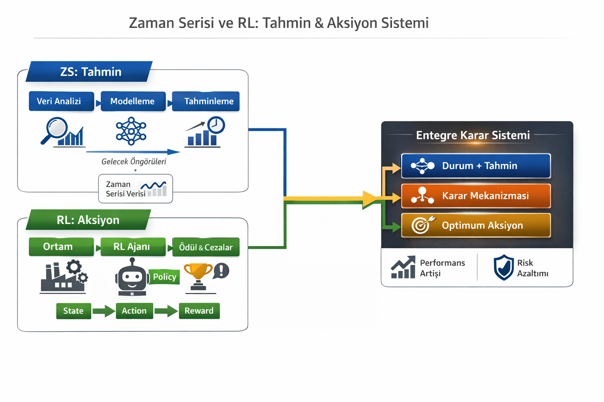

# 🏭 Production AI Project  
### **Dijital İkiz, Zaman Serisi ve Pekiştirmeli Öğrenme Tabanlı Üretim Optimizasyonu**


Bu iskelet proje, iki bağımsız modül için hazırlanmıştır:
- `zs_time_series/` (Zaman Serisi)
- `rl_reinforcement/` (Pekiştirmeli Öğrenme)

## 0) VS Code ile aç
- Klasörü aç: `production_ai_project_skeleton/`

## 1) Sanal ortam kur (Windows PowerShell)
```powershell
python -m venv .venv
.\.venv\Scripts\Activate.ps1
python -m pip install --upgrade pip
pip install -r requirements.txt
```

## 2) Çıktı klasörleri
- ZS çıktıları: `zs_time_series/outputs/`
- RL çıktıları: `rl_reinforcement/outputs/`

> Kod modül modül eklenecek.
-------------------------------------------------------------------------------------------------------------------------------------------------------------------
## 📐 Sistem Akışı (System Architecture)



## 1. Proje Tanımı ve Amacı

Bu proje, **üretim hatlarının karar verme süreçlerini yapay zeka ile optimize etmeyi** amaçlayan,  
**Dijital İkiz (Digital Twin)**, **Zaman Serisi Analizi** ve **Pekiştirmeli Öğrenme (Reinforcement Learning)** bileşenlerini entegre eden bütüncül bir **Production AI** mimarisi sunmaktadır.

Amaç;  
- üretim hattının sanal bir kopyasını oluşturmak,  
- geleceğe yönelik kritik değişkenleri tahmin etmek,  
- bu tahminleri kullanarak **öğrenen bir ajan** ile operasyonel kararları optimize etmektir.

Bu kapsamda proje, klasik kural-tabanlı üretim planlamasının ötesine geçerek **özerk, adaptif ve veri güdümlü** bir sistem tasarlamaktadır.

---

## 2. Problem Tanımı

Geleneksel üretim sistemlerinde karşılaşılan temel problemler:

- İş istasyonları arasında **denge bozukluğu**
- Aşırı veya yetersiz **WIP (Work In Progress)**
- Talep dalgalanmalarına karşı **reaktif** karar alma
- Sabit kurallara dayalı, öğrenmeyen planlama yaklaşımları

Bu proje, söz konusu problemlere **öğrenen ve simülasyon destekli** bir çözüm sunmayı hedefler.

---

## 3. Sistem Mimarisi

Sistem üç ana katmandan oluşmaktadır:

### 3.1 Dijital İkiz (Digital Twin)
Gerçek üretim hattının davranışını taklit eden simülasyon ortamı:
- İş istasyonları  
- İşlem süreleri  
- Kuyruk yapıları  
- WIP dinamikleri  

### 3.2 Zaman Serisi Analizi
Üretim sürecine ait geçmiş verilere dayanarak:
- Talep tahmini  
- Çevrim süresi öngörüsü  
- Gecikme eğilimleri  

üretilir ve bu çıktılar karar mekanizmasına girdi sağlar.

### 3.3 Pekiştirmeli Öğrenme
Üretim hattı bir **çevre (environment)** olarak modellenir:
- **Durum (State):** WIP, kuyruk uzunlukları, zaman serisi tahminleri  
- **Aksiyon (Action):** yönlendirme, hız ve öncelik kararları  
- **Ödül (Reward):** verimlilik, gecikme, denge kriterleri  

Amaç, uzun vadede **optimal üretim politikası** öğrenmektir.

---

## 4. Proje Klasör Yapısı

```text
production_ai_project/
│
├── digital_twin/          # Üretim hattı simülasyonu (Dijital İkiz)
├── zs_time_series/        # Zaman serisi tahmin modelleri
├── rl_reinforcement/     # RL ortamı ve ajan eğitimi
│
├── src/                   # Ortak yardımcı modüller
├── report/                # Akademik raporlar ve analizler
│
├── requirements.txt
└── README.md
```

---

## 5. Yöntem

1. Dijital ikiz ile üretim hattının modellenmesi  
2. Simülasyon veya gerçek veriden zaman serisi oluşturulması  
3. Tahmin modelleri ile ileriye dönük öngörü üretilmesi  
4. Tahminlerin RL ortamına entegre edilmesi  
5. RL ajanının ödül fonksiyonu üzerinden eğitilmesi  

Bu yapı, **tahmin + karar** döngüsünü kapatan hibrit bir yapay zeka yaklaşımıdır.

---

## 6. Bilimsel Katkı

- Dijital ikiz + RL entegrasyonunun modüler sunumu  
- Zaman serisi çıktılarının RL durum uzayına dahil edilmesi  
- Akademik çalışmalar için tekrar üretilebilir deney ortamı  
- Endüstriyel üretim senaryolarına uyarlanabilir mimari  

---

## 7. Kullanım Alanları

- Akıllı fabrika sistemleri  
- Üretim planlama ve çizelgeleme  
- Endüstri 4.0 / 5.0 uygulamaları  
- Akademik araştırmalar  

---

## 8. Gelecek Çalışmalar

- Çok ajanlı pekiştirmeli öğrenme  
- Gerçek zamanlı sensör verisi entegrasyonu  
- Farklı ödül fonksiyonu tasarımları  
- Endüstriyel vaka çalışmaları  

---

## 9. Sonuç

Bu proje, üretim sistemlerini **öğrenen, öngören ve adapte olan** bir yapıya dönüştürmeyi hedefleyen  
akademik nitelikte bir **Production AI** yaklaşımı sunmaktadır.
